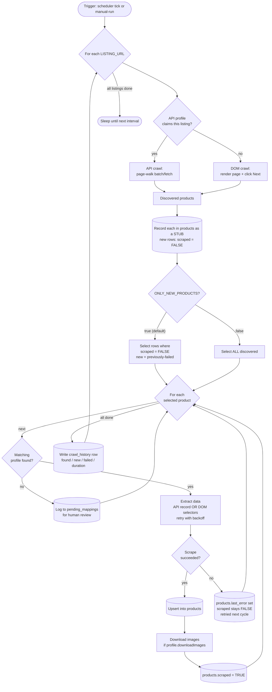
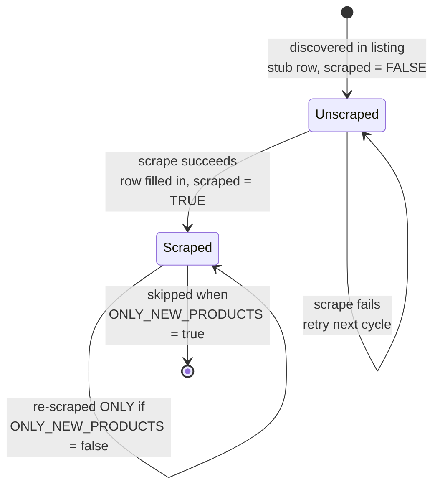
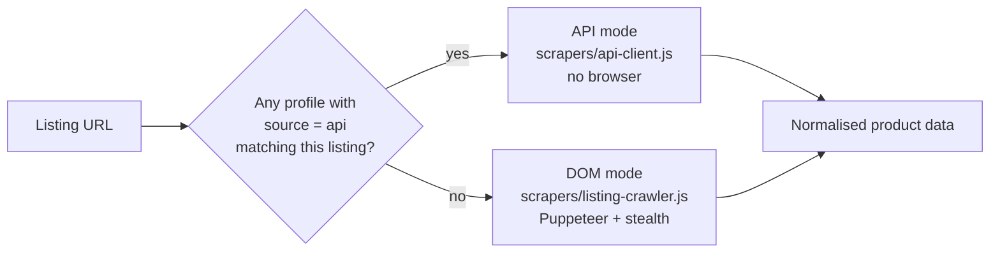

# Product Monitor — Auto-Detecting Scraper

A Node.js service that monitors marketplace **listing pages**, detects **new products**,
scrapes their details, downloads images, and stores everything in **MySQL** — on a
recurring schedule (default every 2 hours).

It is **profile-driven**: each site/URL pattern is described by a JSON file in
`profiles/`. A profile can pull data two ways:

| Source mode         | When it's used                                                      | How it works                                                                             |
| ------------------- | ------------------------------------------------------------------- | ---------------------------------------------------------------------------------------- |
| **`api`**           | The site is a JS app backed by a JSON API (e.g. 101lab / GreenBidz) | Calls the REST API directly, paginates, maps fields. No browser. Fast + reliable.        |
| **`dom`** (default) | A normal server-rendered site                                       | Puppeteer (stealth) renders the page and reads CSS selectors. Follows "Next" pagination. |

> **Why both?** The first target — `101lab.co` — is a React single-page app. Its HTML
> is an empty shell; product cards navigate via JavaScript (no `<a href>`), and there is
> no price in the DOM. But it's powered by a clean REST API
> (`api.101recycle.greenbidz.com`) that returns title, description, price, images and
> pagination metadata. So the 101lab profile uses **API mode**, while the generic
> Puppeteer/CSS engine remains available for any other site.

---

## Table of contents

1. [Key features](#key-features)
2. [How it works (the pipeline)](#how-it-works-the-pipeline)
3. [Flow diagram](#flow-diagram)
4. [The deciding boolean: `ONLY_NEW_PRODUCTS`](#the-deciding-boolean-only_new_products)
5. [Step-by-step scenarios (with examples)](#step-by-step-scenarios-with-examples)
6. [Project structure](#project-structure)
7. [Database schema](#database-schema)
8. [Setup](#setup)
9. [Configuration (`.env`)](#configuration-env)
10. [Mapping profiles](#mapping-profiles)
11. [Commands](#commands)
12. [Notes, gotchas & porting decisions](#notes-gotchas--porting-decisions)

---

## Key features

- 🔁 **Scheduler** — runs every `CRAWL_INTERVAL_HOURS` (default 2) via `node-cron`, plus an immediate first run.
- 🆕 **New-product detection** — the `products.scraped` flag tracks every product and whether it's been scraped (no separate queue table).
- 🧭 **Profile-driven extraction** — one JSON profile per URL pattern; `api` or `dom` source.
- 🖥️ **Review UI** — a web page to enter a listing URL, auto-detect a new profile, edit & save it, then scrape.
- 📄 **Pagination** — API page-walking, or DOM "Next"-button clicking.
- 🖼️ **Image download** — saves to `downloads/{domain}/{productId}/` (toggle per profile).
- ♻️ **Retry with backoff** — failed scrapes retry up to `MAX_RETRIES` with exponential delay.
- 🗃️ **MySQL storage** — products (with discovery flag), crawl history, pending mappings.
- 🧰 **CLI tools** — create / edit / validate profiles interactively; manual one-off runs; manual profile override.
- 📝 **Pending mappings** — URLs with no matching profile are logged for human review.

---

## How it works (the pipeline)

Per listing URL, every cycle:

```
1. DISCOVER   Crawl the listing → list of products (API page-walk or DOM "Next" pages)
2. RECORD     Insert every product into products as a STUB (new rows → scraped = FALSE)
3. SELECT     Decide what to scrape based on ONLY_NEW_PRODUCTS:
                 true  → only rows where scraped = FALSE  (new + previously-failed)
                 false → every discovered product          (refresh existing too)
4. SCRAPE     For each selected product:
                 • resolve its profile
                 • extract data (API record OR DOM selectors, with retry)
                 • upsert into products (fills the stub, sets scraped = TRUE)
                 • download images (if profile.downloadImages)
5. RECORD     Write one row to crawl_history (found / new / failed / duration)
```

> **One table, no queue.** Discovery and the "have we scraped this?" flag live on the
> **`products`** table itself (the `scraped` boolean) — there is no separate
> `seen_products` table. A discovered product is a stub row with `scraped = FALSE`; a
> successful scrape fills the row in and sets `scraped = TRUE`.

Key idea: **discovery and scraping are separated.** First we learn _what exists_
(cheap), then we decide _what to scrape_ (governed by the boolean), then we scrape.

---

## Flow diagram

### Crawl cycle (one listing URL)



### Product lifecycle (the `products.scraped` flag)



### Profile resolution (API vs DOM)



> These diagrams use [Mermaid](https://mermaid.js.org/), which renders automatically on
> GitHub and most Markdown viewers (VS Code: install the *Markdown Preview Mermaid
> Support* extension).

---

## The deciding boolean: `ONLY_NEW_PRODUCTS`

Set in `.env` (and read in `config/constants.js`). **Default: `true`.**

| Value   | Behaviour                                                                                                                                                                                      |
| ------- | ---------------------------------------------------------------------------------------------------------------------------------------------------------------------------------------------- |
| `true`  | Each cycle scrapes **only products not yet scraped** (`products.scraped = FALSE`). This includes brand-new products and any that failed previously. Already-scraped products are skipped. |
| `false` | Each cycle **re-scrapes every discovered product**, refreshing existing rows (e.g. to catch price changes).                                                                                    |

How a product moves through the `products` table:

```
discovered ──► products stub row created with scraped = FALSE
   │
   ├─ scrape succeeds ──► row filled in, scraped = TRUE, scraped_at = now  (skipped next cycle when flag = true)
   └─ scrape fails    ──► scraped stays FALSE                              (retried next cycle)
```

Switching modes is config-only — no code change.

---

## Step-by-step scenarios (with examples)

All examples use the live 101lab profile (`profiles/profile_101lab.json`, **API mode**)
and real data, e.g. product **batchNumber 2473** → URL
`https://101lab.co/buyer-marketplace/2473` → _"Bresser Microscope"_, price `450 USD`.

### Scenario A — First run, cold start (`ONLY_NEW_PRODUCTS=true`)

You run `npm run setup` then `npm start`. The DB is empty.

```
[12:00:00] 🚀 Product Monitor starting…
[12:00:00] Monitoring 1 listing URL(s):
[12:00:00]    • https://101lab.co/buyer-marketplace
[12:00:01] ✅ Database connection OK.
[12:00:01] ⏰ Scheduler started — running every 2 hour(s) [cron: "0 */2 * * *"]
[12:00:01] Using API profile "profile_101lab.json" for https://101lab.co/buyer-marketplace
[12:00:01] 🔍 Crawling API: https://api.101recycle.greenbidz.com/api/v1/batch/fetch
[12:00:03] 📄 API page 1: 50 record(s) (total collected: 50 / 67)
[12:00:04] 📄 API page 2: 17 record(s) (total collected: 67 / 67)
[12:00:04] ✅ Completed API pagination. Total products: 67 (reported total: 67).
[12:00:04] 🆕 Discovered 67 product(s): 67 brand-new; 67 to scrape (mode: only-new).
[12:00:04] 📥 Processing: https://101lab.co/buyer-marketplace/2473
[12:00:04]   ✅ Title: "Bresser Microscope" (using profile_101lab.json)
[12:00:04]   💾 Saved to database (ID: 1)
[12:00:05]   🖼️ Downloaded 1 image(s) to downloads/101lab.co/1/
            … (66 more) …
[12:00:42] 📊 Crawl complete: 67 new, 67 scraped, 0 failed (API) (41s)
```

**What's in the DB afterwards** — `products` (67 rows), each fully filled in with `scraped = TRUE`:

| id  | external_id | title            | price  | scraped    | scraped_at |
| --- | ----------- | ---------------- | ------ | ---------- | ---------- |
| 1   | 2473        | Bresser Microscope | 450.00 | `1` (TRUE) | 12:00:04   |
| …   | …           | …                | …      | `1`        | …          |

Each row also has `description`, `images_remote_urls`, `images_local_paths`, and
`raw_data` (the full API record).

### Scenario B — 2 hours later, 2 new products were listed (`true`)

The scheduler fires again. The marketplace now has 69 products (2 added).

```
[14:00:00] 🔍 Crawling API: …/batch/fetch
[14:00:03] ✅ Completed API pagination. Total products: 69 (reported total: 69).
[14:00:03] 🆕 Discovered 69 product(s): 2 brand-new; 2 to scrape (mode: only-new).
[14:00:03] 📥 Processing: https://101lab.co/buyer-marketplace/2490
[14:00:03]   ✅ Title: "Eppendorf Centrifuge 5424" (using profile_101lab.json)
[14:00:03]   💾 Saved to database (ID: 68)
[14:00:04] 📥 Processing: https://101lab.co/buyer-marketplace/2491
[14:00:04]   ✅ Title: "Thermo Scientific Pipette" (using profile_101lab.json)
[14:00:04]   💾 Saved to database (ID: 69)
[14:00:05] 📊 Crawl complete: 2 new, 2 scraped, 0 failed (API) (5s)
```

**Why only 2?** All 67 from Scenario A already have `scraped = TRUE`, so `only-new`
mode skips them. The diff between "discovered (69)" and "to scrape (2)" is exactly the
new products. Fast and cheap.

### Scenario C — A product fails to scrape

Say product 2491's API record is malformed (missing required `title`).

```
[14:00:04] 📥 Processing: https://101lab.co/buyer-marketplace/2491
[14:00:04] ⚠️  Scrape …/2491 failed (attempt 1/4): Missing required field(s): title…
[14:00:06] ⚠️  Scrape …/2491 failed (attempt 2/4): …
[14:00:10] ❌ Failed to scrape …/2491: Missing required field(s): title
[14:00:10] 📊 Crawl complete: 2 new, 1 scraped, 1 failed (API) (8s)
```

**State:** product 2491's `products.scraped` stays **FALSE**, with `last_error` set and
`scrape_attempts` incremented on its row. **Next cycle (16:00)** it will be picked up
again (it's still unscraped) and retried.

### Scenario D — Refresh existing products (`ONLY_NEW_PRODUCTS=false`)

You want to refresh prices/descriptions of everything. Set `ONLY_NEW_PRODUCTS=false`
in `.env`, restart.

```
[16:00:03] 🆕 Discovered 69 product(s): 0 brand-new; 69 to scrape (mode: all).
[16:00:03] 📥 Processing: …/2473
[16:00:03]   ✅ Title: "Bresser Microscope" (using profile_101lab.json)
[16:00:03]   💾 Saved to database (ID: 1)        ← UPSERT: updates existing row 1
            … all 69 re-scraped …
[16:00:55] 📊 Crawl complete: 0 new, 69 scraped, 0 failed (API) (52s)
```

`products` rows are **upserted** (matched on `product_url`): price/description/images
refreshed, `last_seen_at` bumped, `scrape_attempts` incremented. No duplicates.

### Scenario E — Manual override for a single product

Force a specific profile for one URL (handy for testing a profile or re-fetching one item):

```bash
npm run manual-override -- --url=https://101lab.co/buyer-marketplace/2473 --profile=profile_101lab.json
```

```
[12:30:00] 🔧 Manual override: …/2473 → profile_101lab.json
[12:30:00] Looking up external id 2473 via API…
[12:30:02] ✅ Title: "Bresser Microscope" (using profile_101lab.json)
[12:30:02]   💾 Saved to database (ID: 1)
[12:30:02] ✅ Override complete — product ID 1.
```

(For API profiles it finds the record by `batchNumber`; for DOM profiles it renders the
page with Puppeteer and applies the forced selectors.)

### Scenario F — A URL with no matching profile

During a DOM crawl, a product URL appears that no profile's `urlPattern` matches:

```
[12:00:10] ❌ No mapping found for pattern: https://101lab\.co/new\-format/\d+
[12:00:10] 📝 Added to pending_mappings table for review
```

A row lands in `pending_mappings` (status `pending`) with the generalised pattern and a
sample URL. You then create a profile for it:

```bash
npm run create-mapping        # interactive — asks for selectors, image toggle, etc.
npm run validate-mappings     # structural check (add --live to test selectors in a browser)
```

Next cycle, that pattern now resolves and its products get scraped.

---

## Web review UI

Start it with `npm run web`, then open **http://localhost:5173**.

It's a single page with three steps that mirror Scenario F (verifying a new profile)
without touching the CLI:

1. **Analyze a listing URL** — paste a listing URL (optionally a sample product URL).
   The server checks for a matching profile:
   - **Existing profile** → shows which one (`api`/`dom`) and lets you scrape directly.
   - **New pattern** → renders a sample product, auto-detects fields, and opens an
     editable **review form**.
   - **Can't auto-find links** (e.g. a JS app with no anchors) → asks you to paste a
     sample product URL.
2. **Review & edit** — tweak the profile name, URL pattern, and **source**. Changing
   the **Source dropdown re-analyzes the site for that mode and auto-fills the fields**:
   - `dom` → renders a sample product and fills CSS-selector field rows + image/wait-for
     selectors.
   - `api` → **sniffs the listing page's XHR/fetch calls**, finds the JSON endpoint, and
     fills the API URL, query params, page param, data path, id field, product-URL
     template (`{id}`), pagination paths, and a guessed field-map (record-key → field).

   A **↻ re-detect fields** button re-runs detection on demand. The auto-detected sample
   record/selectors are shown read-only for reference. **Save** validates for the chosen
   source and writes the JSON profile into `profiles/`.

   > Detection is a best-guess starting point — always review it. For example, on 101lab
   > the API detector auto-recovers the real `batch/fetch` endpoint, `dataPath=data`,
   > `idField=batchNumber`, pagination paths, and field-map; you just confirm/tweak
   > (e.g. price `value` vs `target_price`) and save.
3. **Scrape & store** — runs the crawl for that listing and stores results into
   `products`; the dashboard and product table update with counts and rows.

Endpoints (all JSON): `POST /api/analyze`, `POST /api/detect` (re-analyze for a chosen
source), `POST /api/save-profile`, `POST /api/scrape`, `GET /api/products`,
`GET /api/state`.

> The UI is for setting up/verifying profiles and ad-hoc scrapes. Ongoing monitoring
> still runs via the scheduler (`npm start`).

---

## Project structure

```
product-monitor/
├── main.js                    # Entry point — starts the scheduler
├── manual-run.js              # One-off crawl + manual-override mode
├── setup.js                   # Creates tables, folders, template profile; tests DB
├── package.json
├── .env                       # Configuration (DB, flags, listing URLs)
│
├── config/
│   ├── database.js            # MySQL pool (mysql2/promise) + query/transaction helpers
│   ├── puppeteer.js           # Stealth browser factory
│   └── constants.js           # All env-derived constants (incl. ONLY_NEW_PRODUCTS)
│
├── profiles/                  # One JSON profile per site/URL pattern
│   ├── profile_101lab.json    # 101lab/GreenBidz — API mode (real, working)
│   └── template.json          # Copy-me starter (DOM mode)
│
├── scrapers/
│   ├── api-client.js          # API-mode listing crawl + record→product mapping
│   ├── listing-crawler.js     # DOM-mode pagination crawler ("Next" button)
│   ├── product-extractor.js   # DOM-mode single-product scrape (selectors + retry)
│   └── image-downloader.js    # Saves images locally
│
├── detectors/
│   ├── url-pattern-matcher.js # URL → regex pattern; find matching/API profile
│   ├── field-auto-detector.js # Heuristic CSS-selector guessing (DOM mode)
│   ├── api-detector.js        # Sniffs XHR/fetch to auto-build an API profile block
│   └── diff-analyzer.js        # Pure new-vs-seen diff helper
│
├── database/
│   ├── schema.sql             # MySQL/MariaDB tables
│   ├── queries.js             # All SQL lives here
│   └── migrations/            # Incremental schema changes
│
├── manual-mapping/
│   ├── create-profile.js      # `npm run create-mapping`
│   ├── edit-profile.js        # `npm run edit-mapping`
│   └── validate-profile.js    # `npm run validate-mappings`
│
├── scheduler/
│   └── job-runner.js          # The pipeline + cron scheduler
│
├── web/                       # Review UI (`npm run web`)
│   ├── server.js              # No-framework HTTP API (analyze/save/scrape/products)
│   └── public/index.html      # Single-page review/edit/scrape UI
│
├── scripts/                   # Dev recon tools (inspect live sites)
│   ├── recon.js
│   └── recon-net.js
│
└── utils/
    ├── logger.js              # Colored console + error.log / activity.log
    ├── retry.js               # Exponential-backoff retry wrapper
    ├── file-manager.js        # Profile JSON read/write/list
    └── validators.js          # URL / selector / profile validation
```

---

## Database schema

MySQL / MariaDB. Tables created by `npm run setup` (runs `database/schema.sql`).

- **`products`** — the scraped catalogue **and** the discovery queue in one table.
  Unique on `product_url`. The `scraped` (BOOL, default FALSE) + `scraped_at` columns
  track discovery vs. scraped state. `raw_data`, `images_local_paths`,
  `images_remote_urls` are JSON stored as `LONGTEXT`.
- **`crawl_history`** — one row per crawl cycle (found / new / failed / duration / status).
- **`pending_mappings`** — URL patterns with no profile yet, awaiting a human.

> The old separate `seen_products` table was removed and merged into `products`
> (see `database/migrations/20260604_000002_merge_seen_products_into_products.sql`).

---

## Setup

### 1. Prerequisites

- **Node.js 18+** (uses ES modules + global `fetch`).
- A **MySQL or MariaDB** server. On Windows, **XAMPP** ships one (`C:\xampp`).

### 2. Start MySQL (XAMPP example)

Use the **XAMPP Control Panel → Start MySQL**, or from a terminal:

```powershell
Start-Process "C:\xampp\mysql\bin\mysqld.exe" -ArgumentList "--defaults-file=C:\xampp\mysql\bin\my.ini --standalone" -WindowStyle Hidden
```

Confirm it's listening on port 3306.

### 3. Install dependencies

```bash
npm install
```

### 4. Create the database

The app creates **tables**, not the database itself. Create it once:

```sql
CREATE DATABASE product_monitor CHARACTER SET utf8mb4 COLLATE utf8mb4_unicode_ci;
```

(XAMPP default user is `root` with an empty password.)

### 5. Configure `.env`

Point it at your DB (see below). Then:

### 6. Run setup

```bash
npm run setup
```

Creates the 4 tables, the `profiles/`, `downloads/`, `logs/` folders, and `template.json`,
and verifies the connection.

### 7. Run

```bash
npm run manual-run     # one-off crawl now
npm start              # start the recurring scheduler
```

---

## Configuration (`.env`)

```ini
# Database (MySQL / MariaDB)
DB_CONNECTION=mysql
DB_HOST=127.0.0.1
DB_PORT=3306
DB_DATABASE=product_monitor
DB_USERNAME=root
DB_PASSWORD=

# Crawler behaviour
CRAWL_INTERVAL_HOURS=2
DOWNLOAD_IMAGES=true
MAX_RETRIES=3
RETRY_DELAY_MS=2000

# Scrape scope — the deciding boolean
#   true  = only scrape products not yet scraped (new products). [default]
#   false = re-scrape every discovered product each cycle.
ONLY_NEW_PRODUCTS=true

# Puppeteer (DOM mode only)
HEADLESS=true
PAGE_TIMEOUT_MS=30000
NAV_WAIT_UNTIL=networkidle2

# Listing pages to crawl (comma-separated)
LISTING_URLS=https://101lab.co/buyer-marketplace
```

---

## Mapping profiles

### API-mode profile (real example — `profiles/profile_101lab.json`)

```jsonc
{
  "profileId": "profile_101lab_20260604",
  "profileName": "101Lab / GreenBidz Marketplace (API)",
  "urlPattern": "https://101lab\\.co/buyer-marketplace/\\d+",
  "domain": "101lab.co",
  "source": "api",
  "downloadImages": true,
  "listingUrls": ["https://101lab.co/buyer-marketplace"],
  "api": {
    "listing": {
      "url": "https://api.101recycle.greenbidz.com/api/v1/batch/fetch",
      "query": { "limit": 50, "lang": "en", "type": "LabGreenbidz" },
      "pageParam": "page",
      "startPage": 1,
      "dataPath": "data",
      "idField": "batchNumber",
      "productUrlTemplate": "https://101lab.co/buyer-marketplace/{id}",
      "pagination": {
        "hasNextPath": "pagination.hasNextPage",
        "totalPagesPath": "pagination.totalPages",
        "totalItemsPath": "pagination.totalItems",
      },
    },
    "fieldMap": {
      "externalId": "batchNumber",
      "title": "title_en",
      "description": "description_en",
      "price": "target_price",
      "images": "firstProductImages",
    },
  },
}
```

- **`listing.url` + `query` + `pageParam`** — how to page through the API.
- **`dataPath`** — where the array of records lives in the response.
- **`pagination.hasNextPath`** — dotted path telling the crawler when to stop.
- **`productUrlTemplate`** — builds the public product URL from `{id}` (the `idField`).
- **`fieldMap`** — maps API record keys → normalised product fields.

### DOM-mode profile (`profiles/template.json`)

Uses CSS selectors instead of an API block:

```jsonc
{
  "urlPattern": "https://example\\.com/product/\\d+",
  "domain": "example.com",
  "downloadImages": true,
  "fields": {
    "title": {
      "selector": "h1",
      "type": "text",
      "required": true,
      "fallback": ".product-title",
    },
    "price": {
      "selector": ".price",
      "type": "text",
      "fallback": "[data-price]",
    },
    "description": { "selector": ".description", "type": "html" },
  },
  "selectors": {
    "images": "img.product-image",
    "waitForSelector": ".product-container",
    "timeout": 10000,
  },
}
```

(No `"source"` key, or `"source": "dom"`, means DOM mode.)

---

## Commands

| Command                                                            | What it does                                                        |
| ------------------------------------------------------------------ | ------------------------------------------------------------------- |
| `npm run setup`                                                    | Create tables/folders, test DB, write `template.json`.              |
| `npm run web`                                                      | Start the **review UI** at http://localhost:5173 (set `WEB_PORT` to change). |
| `npm start`                                                        | Start the scheduler (immediate run + every `CRAWL_INTERVAL_HOURS`). |
| `npm run manual-run`                                               | One-off crawl of all `LISTING_URLS` right now.                      |
| `npm run manual-run -- --listing=<url>`                            | One-off crawl of a specific listing.                                |
| `npm run manual-override -- --url=<product> --profile=<file.json>` | Force a profile for one product.                                    |
| `npm run create-mapping`                                           | Interactive: create a new profile.                                  |
| `npm run edit-mapping`                                             | Interactive: edit an existing profile.                              |
| `npm run validate-mappings`                                        | Validate profiles (add `--live` to test selectors in a browser).    |

---

## Notes, gotchas & porting decisions

- **Database is MySQL, not PostgreSQL.** The original spec was PostgreSQL; the data layer
  was ported to MySQL: `mysql2` driver, `JSON`→`LONGTEXT`, `TEXT[]`→JSON-in-`LONGTEXT`,
  `SERIAL`→`INT AUTO_INCREMENT`, `NOW()`→`CURRENT_TIMESTAMP`.
- **MariaDB 10.1 compatibility.** XAMPP ships MariaDB 10.1, which has **no `JSON` column
  type** (added in 10.2.7) → JSON columns use `LONGTEXT` (portable to MySQL 8 too).
  Indexed URL columns are `VARCHAR(191)` (the 767-byte utf8mb4 key limit on 10.1).
- **101lab is API-backed.** Its DOM has no product links and no price, so DOM scraping
  doesn't work there — hence API mode. The generic Puppeteer/CSS engine still works for
  normal sites.
- **Don't point this at a production DB with a `products` table.** The remote `greenbidz`
  database already has a `products` table; running the schema there would collide. Use a
  dedicated database (this project uses a local `product_monitor`).
- **Image storage:** `downloads/{domain}/{productId}/image_NN.ext`. Disable globally with
  `DOWNLOAD_IMAGES=false` or per profile with `"downloadImages": false`.
- **Logs:** `logs/error.log` (JSON lines) and `logs/activity.log`.
